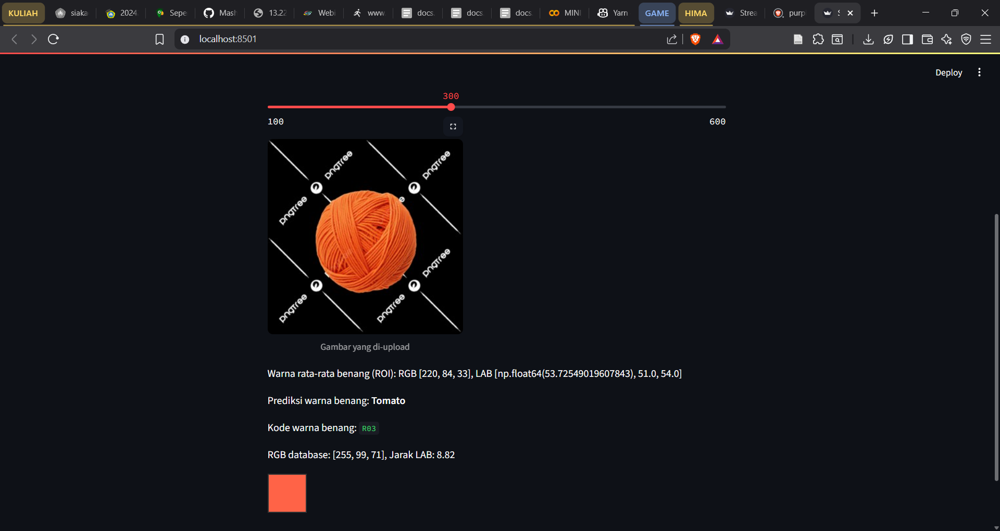
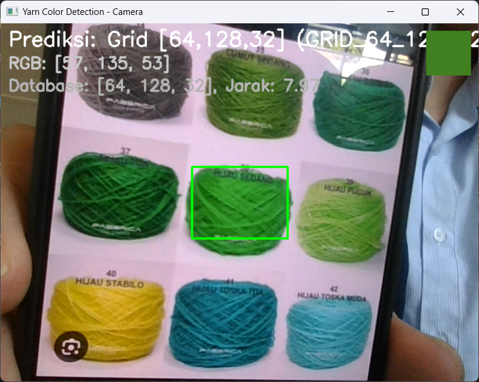

# Yarn Color Detection

## Author: Federico Matthew Pratama - 233405001

---

## Environment Setup

Before running any Python scripts, **make sure you activate your virtual environment (venv)**.

If you have already created a venv, activate it first:

### On Windows (Command Prompt / PowerShell)

```bash
.\venv\Scripts\activate
```

### On MacOS / Linux

```bash
source venv/bin/activate
```

---

## Yarn Color Detection Using Camera

To detect yarn color using your camera, run:

```bash
python live_camera.py
```

Or, if you use Python 3:

```bash
python3 live_camera.py
```

### How to Use

1. Point your camera at the yarn you want to detect.
2. Position the yarn in the center of the green box (the detection area).
3. The detected color information will appear at the bottom of the screen.
4. Press **q** to exit the program.

---

## Yarn Color Detection Using an Image File

To detect yarn color from an image file, run:

```bash
python input_file.py
```

Or, if you use Python 3:

```bash
python3 input_file.py
```

### How to Use

1. Input the path to your yarn image file (e.g. `orange_wol.png`).
2. The detected color information will appear after analysis.
3. Choose whether to save the result or not.
4. Enter another image path or `q` to exit.

---

## Contoh Yarn Image

### Input File



### Live Camera



---

Feel free to contribute or ask questions!
